<!-- page_number: true -->

# Evolving Graphs and Pokemon

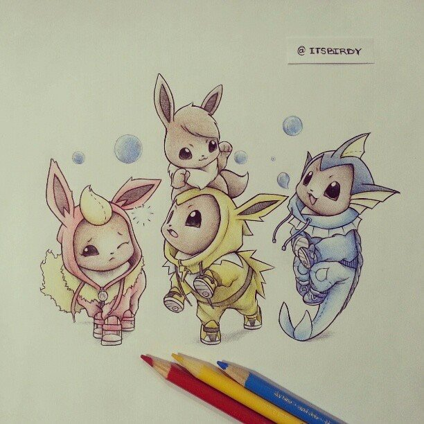

---

# About us

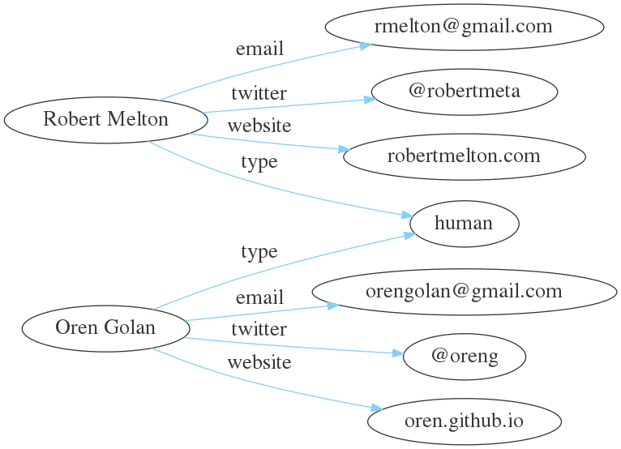

---

# I love feedback!

---


---

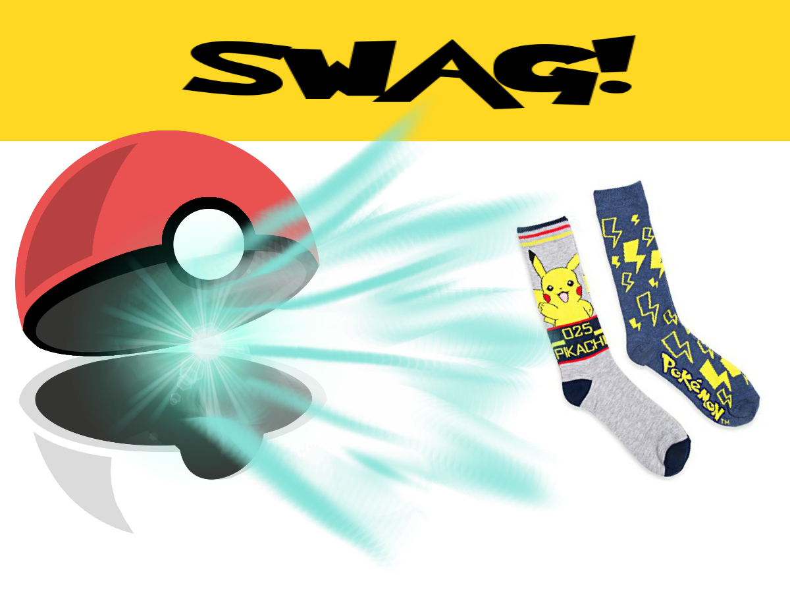

---

Data modeling is hard.  Often you are presented with the challenge of data modeling at the start of a project, when you are least able to make good decisions about how to model that data.  Using the [Cayley](https://github.com/cayleygraph/cayley) graph database can ease the upfront design and allow you a “schema-last” or “schema-later” approach.

This talk follows our journey of trying to model and understand the Pokemon (generation 1) data and build a small web application and graph database around it.  The web application allows querying and visualization of stats, types, locations, breeding, evolutions, and various other attributes.

The talk focuses on the realities of working with unfamiliar data and improving your model as you improve your understanding of the data.  Rather than focusing on the end result, it focus on all the steps and missteps it took to get there and what we learned along the way.

---

# Agenda

- Intro to graph databases
- Cayley, Quads, and RDF
- Modeling Pokemon with Cayley
- Query our data with Cayley

---

# Part 1 - Intro to graph databases

---

## What is a graph?


A set of vertices and edges (or node and relationships)

---

## What is a graph *database*?


It is a structured way of storing and accessing a graph.

---

## Why graph database?

- Relationship
- Whiteboard friendly
- Performance
- Flexibility

---

## graph dbs VS relational dbs

---

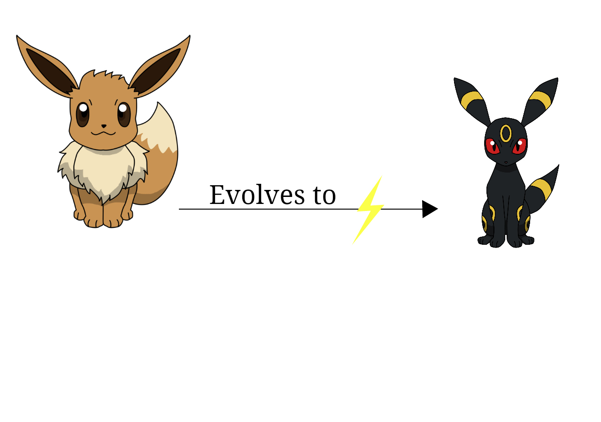

---

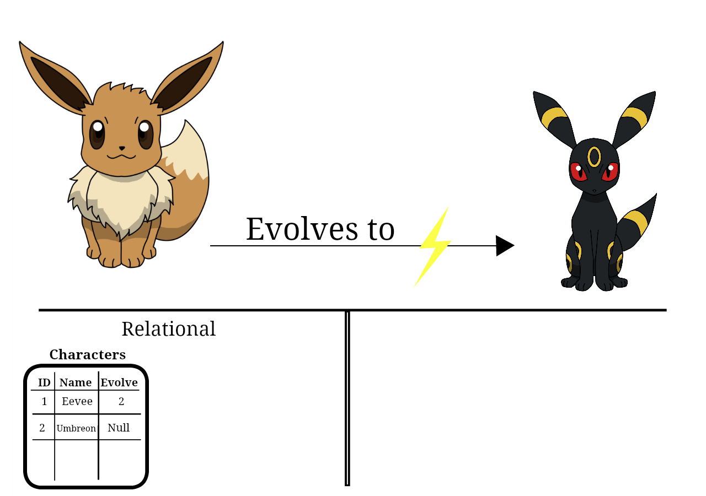

---

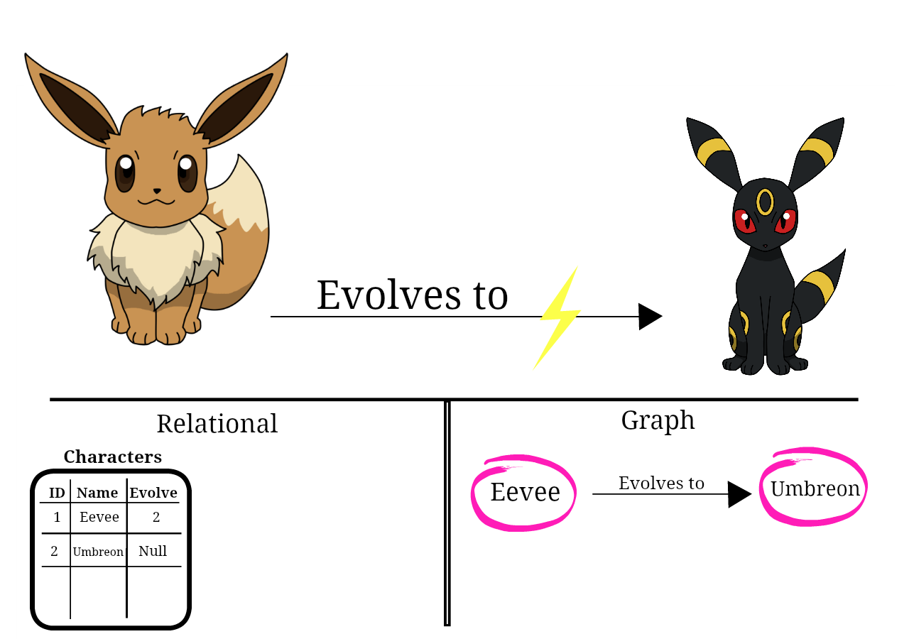

---

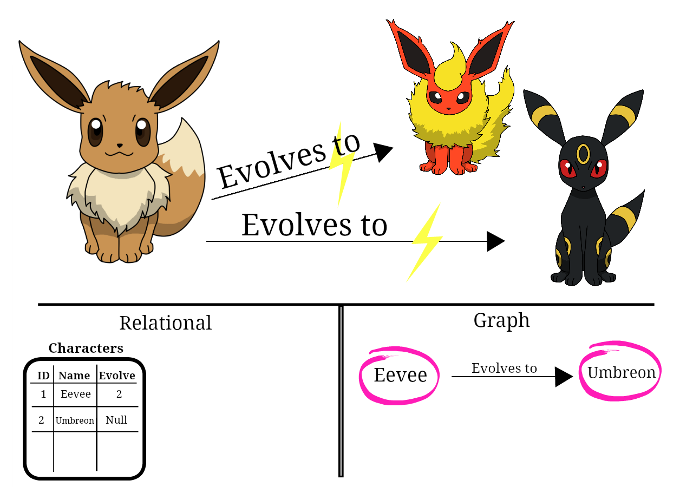

---


---

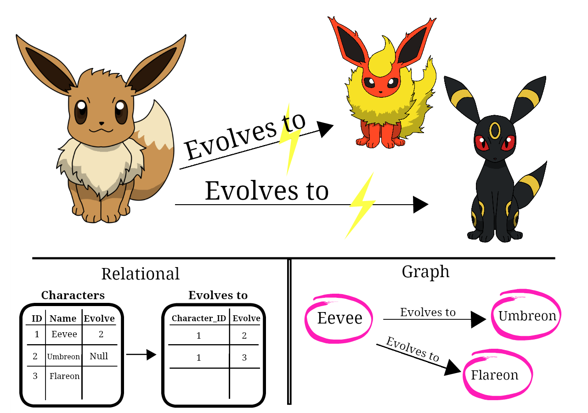

---

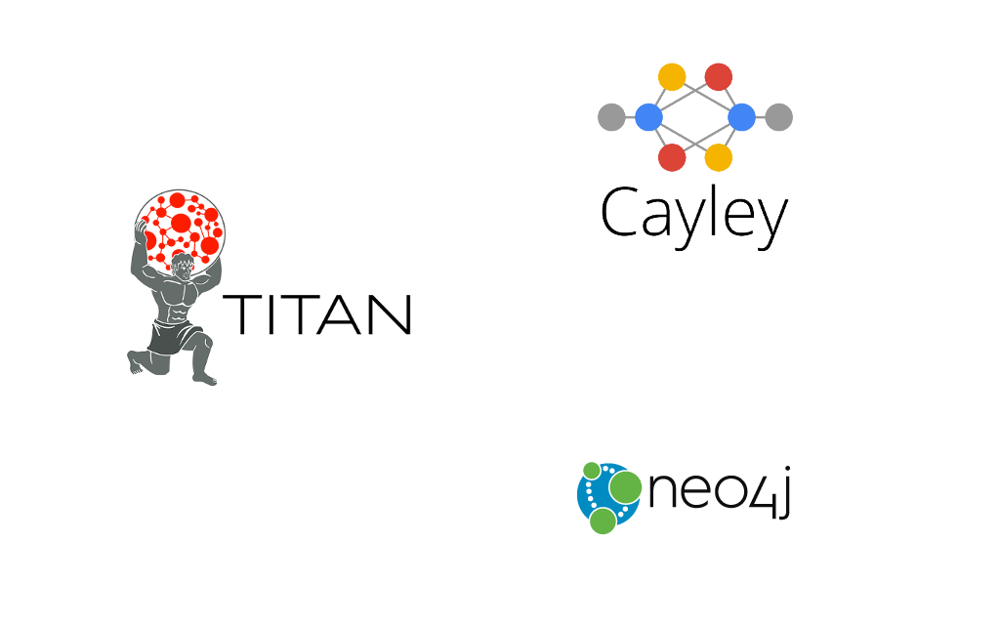

---

# Part 2 - Cayley, Quads, and RDF

---

## Cayley from a high level 

You can consider Cayley as being made up of two parts.  **Quads** (RDF Quads) representing the data, and **Queries** representing how to get data back from those quads. 

---

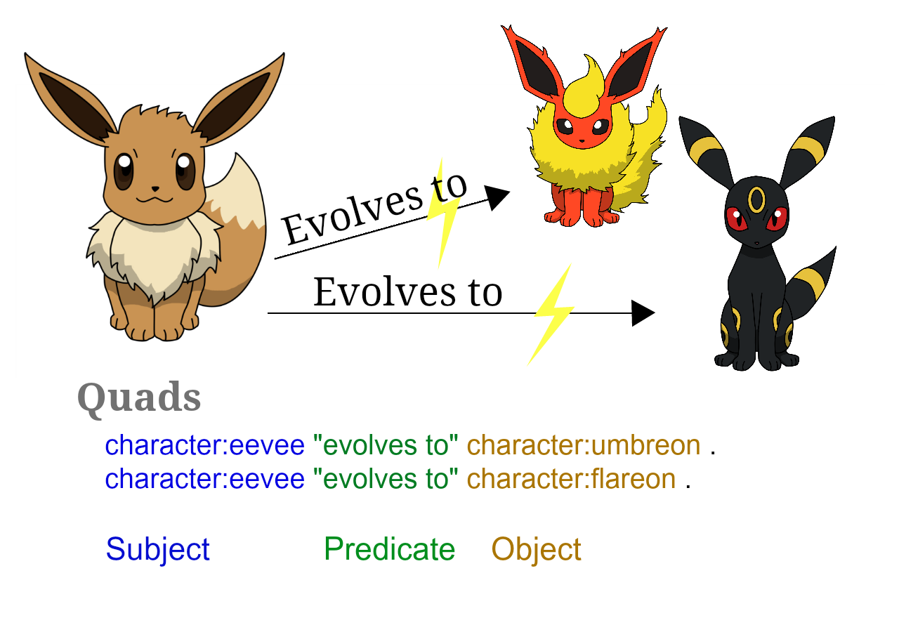

---

## Example for quads


Example of 3 quads:

    Bob     "Listens To"   "Rock Music"   . 
    Bob      Drives         BMW           . 
    Julie   "Listens To"   "Rock Music"   . 
    
Quad format:

    Subject  Predicate      Object

---

## Queries

A query is how we get data back from the database, Cayley support multiple query systems. The most common one is **Gizmo** which is a full JavaScript implementation.

 

`g.V("Bob").Out("Listens To").All();` 

would return "Rock Music".

---

## What is an *RDF* graph database?

RDF is just how the data is stored.  It is a **"Resource Description Framework"**.

Example: `<https://my-domain.com/83599944-77cb-11e6-b812-843a4b0f5a10> <rdf:type> "pokemon" .`

Vocabularies: https://www.w3.org/2011/rdfa-context/rdfa-1.1

---

## Breath


You are doing great!
At this point, we know enough to be dangerous.

---

#  Part 3 - Modeling Pokemon with Cayley

---

## Our plan:

1. [Import Pokemon from CSV into Cayley](https://github.com/oren/pokemon/blob/v0/main.go)
2. [Query and display all Pokemon](https://github.com/oren/pokemon/blob/v1/main.go#L68-L88)
3. [Add uniqueness](https://github.com/oren/pokemon/blob/v3/main.go#L63-L69)
4. [Update a quad](https://github.com/oren/pokemon/blob/v3/main.go#L72-L90)
5. [Show evolution of Pokemon](https://github.com/oren/pokemon/blob/v4/pokemon.go#L121-L140)
6. [Make our graph an RDF](https://github.com/oren/pokemon/blob/v5/pokemon.go#L62-L69)

---

**Step 1.** [Import Pokemon from CSV into Cayley](https://github.com/oren/pokemon/blob/v0/main.go)

https://github.com/PokeAPI/pokeapi/blob/master/data/v2/csv/pokemon.csv


---

**Step 1.** [Import Pokemon from CSV into Cayley](https://github.com/oren/pokemon/blob/v0/main.go)

https://github.com/PokeAPI/pokeapi/tree/master/data/v2/csv


---

**Step 2.** [Query and display all Pokemon](https://github.com/oren/pokemon/blob/v1/main.go#L68-L88)

```
p := cayley.StartPath(store).In(quad.String("name"))
```


---

**Step 2.** [Query and display all Pokemon](https://github.com/oren/pokemon/blob/v1/main.go#L68-L88)

```
p := cayley.StartPath(store).In(quad.String("name"))
```

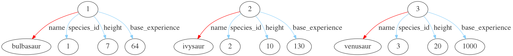

---
**Step 2.** [Query and display all Pokemon](https://github.com/oren/pokemon/blob/v1/main.go#L68-L88)

```
p := cayley.StartPath(store).In(quad.String("name"))
```

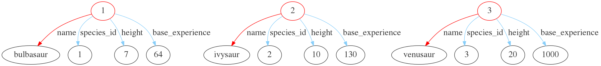

---

**Step 3.** [Add uniqueness](https://github.com/oren/pokemon/blob/v3/main.go#L63-L69)

```
uuid := uuid.NewV1()
```

---

**Step 4.** [Update a quad](https://github.com/oren/pokemon/blob/v3/main.go#L72-L90)

```
t := cayley.NewTransaction()
t.RemoveQuad(quad.Make(uuid, "name", "pikacho", nil))
t.AddQuad(quad.Make(uuid, "name", "pikachu", nil))
err = store.ApplyTransaction(t)
```

---

**Step 5.** [Show evolution of Pokemon](https://github.com/oren/pokemon/blob/v4/pokemon.go#L121-L140)

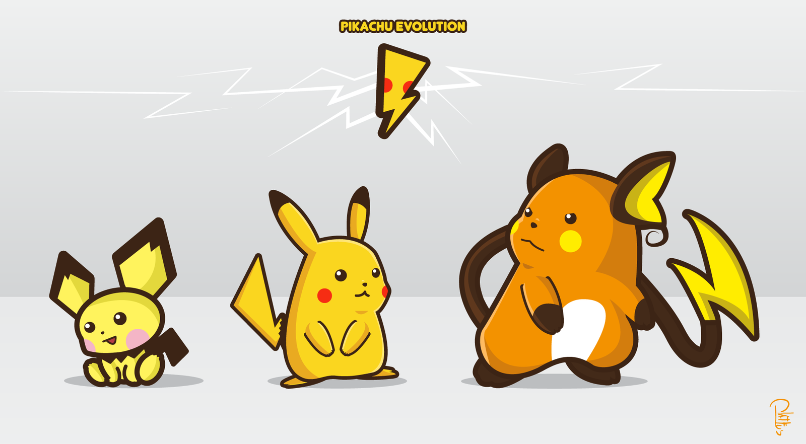

---

**Step 5.** [Show evolution of Pokemon](https://github.com/oren/pokemon/blob/v4/pokemon.go#L121-L140)

https://github.com/PokeAPI/pokeapi/blob/master/data/v2/csv/pokemon_species.csv


---

 **Step 5.** [Show evolution of Pokemon](https://github.com/oren/pokemon/blob/v4/pokemon.go#L121-L140)

<------ Evolves to


---

**Step 5.** [Show evolution of Pokemon](https://github.com/oren/pokemon/blob/v4/pokemon.go#L121-L140)

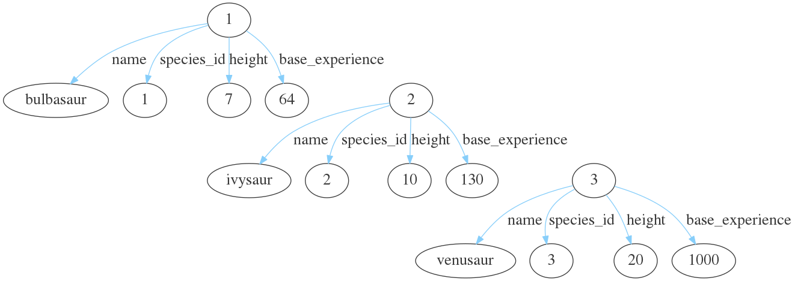

---

**Step 5.** [Show evolution of Pokemon](https://github.com/oren/pokemon/blob/v4/pokemon.go#L121-L140)

    1 evolves_to 2 .
    2 evolves_to 3 .


---

**Step 5.** [Show evolution of Pokemon](https://github.com/oren/pokemon/blob/v4/pokemon.go#L121-L140)

`store.AddQuad(quad.Make(sourcePokemonUUID, "evolves_to", targetPokemonUUID, nil))`

---

**Step 5.** [Show evolution of Pokemon](https://github.com/oren/pokemon/blob/v4/pokemon.go#L121-L140)

`cayley.StartPath(store).Out(quad.String("evolves_to")).Out(quad.String("evolves_to")).Out(quad.String("name"))`

---

**Step 6.** [Make our graph an RDF](https://github.com/oren/pokemon/blob/v5/pokemon.go#L62-L69)

Before:

`83599944-77cb-11e6-b812-843a4b0f5a10 type pokemon .`

After:
   
`<https://my-domain.com/83599944-77cb-11e6-b812-843a4b0f5a10> <rdf:type> "<https://my-domain.com/pokemon>" .`

---

**Step 6.** [Make our graph an RDF](https://github.com/oren/pokemon/blob/v5/pokemon.go#L62-L69)

(Code change)

Before:

    uuid := uuid.NewV1()
    store.AddQuad(quad.Make(uuid, "type", "pokemon", nil))
    
After:

`uuid := quad.IRI("https://my-domain.com/" + uuid.NewV1().String())`

`store.AddQuad(quad.Make(uuid, quad.IRI("rdf:type"), quad.IRI("https://my-domain.com/pokemon"), nil))`
    
---

## Part 4 - Query our data with Cayley

1. Plugable Storage Engine
2. Web console
3. HTTP API
4. Repl

---

**1.** Plugable Storage Engine 

```
  cayley dump --db=bolt --dbpath=data/pokemon.boltdb   # dump the database into a quad file
  cayley init --config=cayley.cfg                      # assumes the database exist but no table
  cayley load --config=cayley.cfg --quads=dbdump.nq    # load a quad file and using a configuration file
```

**Official:** In-Memory, BoltDB, PostgreSQL, Cassandra (soon)   
**Working:** LevelDB, MongoDB, GAE datastore, etcd, RethinkDB  
**Future:** MySQL, CockroachDB, Dgraph

---

**2.** Cayley's Web console


    cayley http --config=cayley.cfg


http://localhost:64210

---

**2.** Cayley's Web console

Example 1: Find what pichu evolves into after 2 phases of evolution

`g.V("pichu").In("<schema:name>").Out("<rdf:evolves_to>").Out("<rdf:evolves_to>").Out("<schema:name>").All()`

```
{
  "result": [
    {
      "id": "raichu"
    }
  ]
}
```

---
**2.** Cayley's Web console

Example 1: Find what pichu evolves into after 2 phases of evolution

`g.V("pichu").In("<schema:name>").Out("<rdf:evolves_to>").Out("<rdf:evolves_to>").Out("<schema:name>").All()`

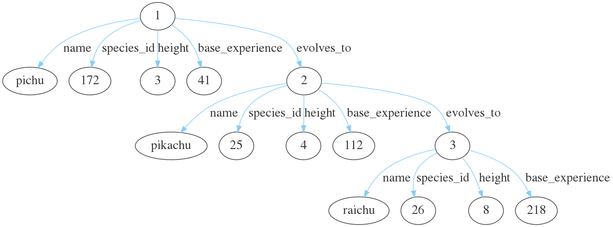

---

**2.** Cayley's Web console

Example 1: Find what pichu evolves into after 2 phases of evolution

`g.V("pichu").In("<schema:name>").Out("<rdf:evolves_to>").Out("<rdf:evolves_to>").Out("<schema:name>").All()`

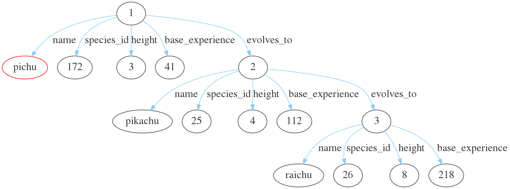

---

**2.** Cayley's Web console

Example 1: Find what pichu evolves into after 2 phases of evolution

`g.V("pichu").In("<schema:name>").Out("<rdf:evolves_to>").Out("<rdf:evolves_to>").Out("<schema:name>").All()`

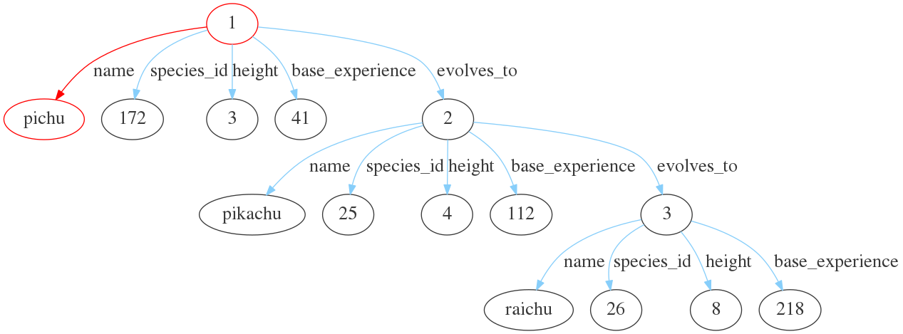

---

**2.** Cayley's Web console

Example 1: Find what pichu evolves into after 2 phases of evolution

`g.V("pichu").In("<schema:name>").Out("<rdf:evolves_to>").Out("<rdf:evolves_to>").Out("<schema:name>").All()`

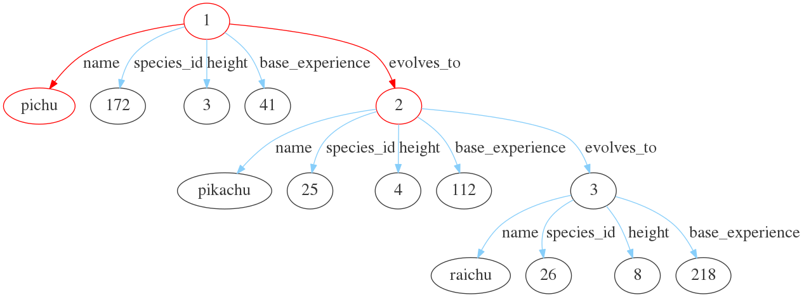

---

**2.** Cayley's Web console

Example 1: Find what pichu evolves into after 2 phases of evolution

`g.V("pichu").In("<schema:name>").Out("<rdf:evolves_to>").Out("<rdf:evolves_to>").Out("<schema:name>").All()`

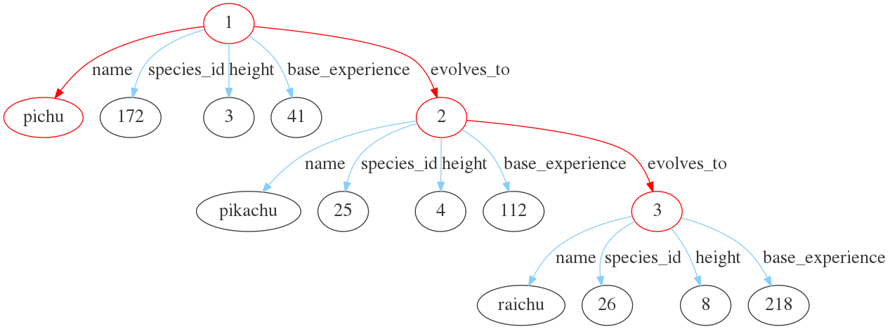

---

**2.** Cayley's Web console

Example 1: Find what pichu evolves into after 2 phases of evolution

`g.V("pichu").In("<schema:name>").Out("<rdf:evolves_to>").Out("<rdf:evolves_to>").Out("<schema:name>").All()`

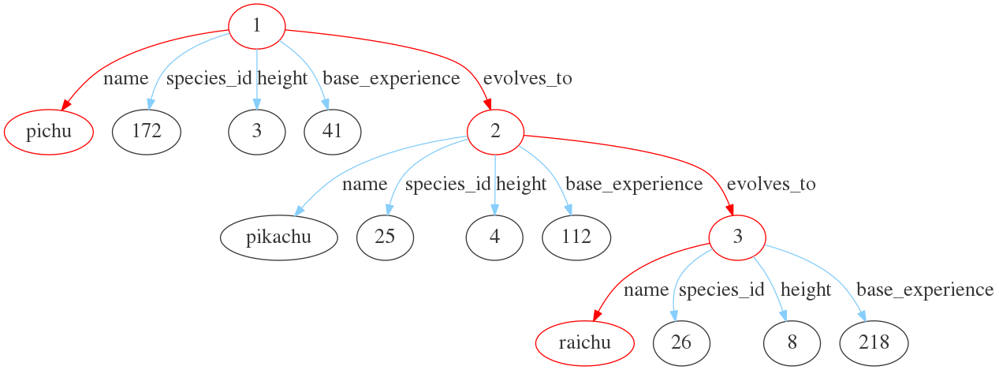

---

**2.** Cayley's Web console

Example 2: Find all pokemons that are the result of 2 phases of evolution


`g.V().In("<schema:name>").Out("<rdf:evolves_to>").Out("<rdf:evolves_to>").Out("<schema:name>").All()`

---

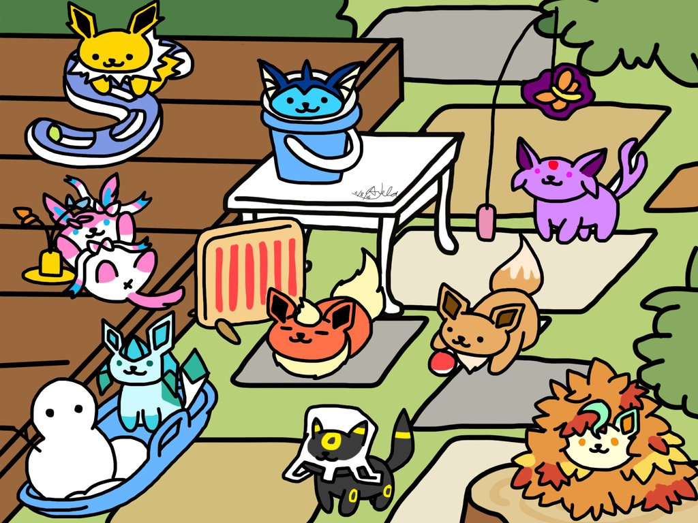

---
**2.** Cayley's Web console

Example 3: Find all the evolutions of eevee

`g.V("eevee").In("<schema:name>").Out("<rdf:evolves_to>").Out("<schema:name>").All()`

```  
{
 "result": [
  {
   "id": "leafeon"
  },
  {
   "id": "sylveon"
  },
  {
   "id": "vaporeon"
  },
  {
   "id": "flareon"
  },
 ... more results ...
 ]
}
```

---

**3.** Cayley's HTTP API

Find all the evolutions of eevee


`curl http://localhost:64210/api/v1/query/gremlin -d 'g.V("eevee").In("<schema:name>").Out("<rdf:evolves_to>").Out("<schema:name>").All()'`

---

**4.** Cayley's Repl

```
cayley repl --config=cayley.cfg
```

---

## Additional Reading

- Cayley Repository -  https://github.com/cayleygraph/cayley
- Cayley Forum - https://cayley.io
- Chat - #cayley on Freenode

---

# Thank you!
