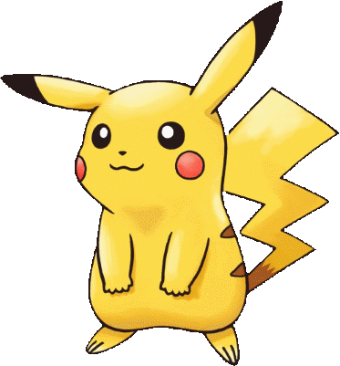
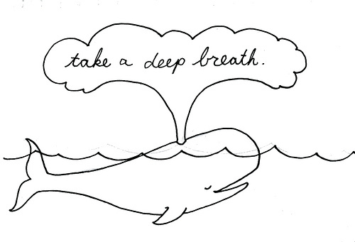

<!-- page_number: true -->

# Evolving Graphs and Pokemon


---

# What are pokemon?

## Pocket Monsters!


```Note: This is Pikachu, he is adorable.```

---

# What is a graph?

This is a graph. 
```Note: an oversimplified one```

---

# What is a graph *database*?

It is a structured way of storing and accessing a graph.
```Tip: this picture won't be referenced again, so enjoy it```

---

# What is an *RDF* graph database?
RDF is just how the data is stored.  It is a **"Resource Description Framework"**.


---


You can consider Cayley as being made up of two parts.  **Quads** (RDF Quads) representing the data, and **Queries** representing how to get data back from those quads. 

---

# Quads?

A quad is a very simple data description. 

**Subject | Predicate | Object | Label**

- **Subject**: the acting entity
- **Predicate**: verb stating somthing about the subject
- **Object**: acted apon by the subject according to the predicate
- **Label**: generally this is used to track data sources (often unused)

---

# (Oversimplified) Example


Bob | Listens To | Rock Music | . 
Bob | Drives | BMW | . 
Julie | Listens To | Rock Music | . 
...

```
Reminder: Quad | Subject | Predicate | Object
```

---

# Gotcha 1: Directionality

```Bob -> Listens To -> Rock Music```

but... 

Rock Music never Listens To Bob ... because Rock Music is a bad friend. 

---

# Gotcha #2: Duplicate quads

Duplicate quads make no sense, as they are already completely stored.  You can either ignore them or error on them depending on data expectations.


---

# Queries?


```Tip: this is not the time to ask questions```
A query is how we get data back from the database, Cayley support multiple query systems, but in this talk we will focus on Gizmo.

---

# Gizmo?
 Gizmo is the most common query system used with Cayley, it is a full javascript implementation.  
```g.V("Bob").Out("Listens To").All();```
would return **Rock Music**.

---

# Breathe
Doing great!

```Hopefully at this point, we know enough to be dangerous!```

---

# Back to Pokemon

 Since all the cool kids know about Pokemon, we wanted to be in the loop.. but since we are geeks, we decide to do it make a graph of pokemon.

---

# Lesson 2

Don't trust external ids because they could be wrong or chang later
```
134, eevee, 133, 4
134, vaporeon, 134, 4
```

---

# Additional Reading

- IRI
- Schema
- RDF

---

<!-- Always say who you are a the end, it is a boring start -->
# About us

##### Robert Melton

- https://www.robertmelton.com
- @robertmeta
- rmelton@gmail.com

##### Oren Golan

- https://oren.github.io
- @oreng
- orengolan@gmail.com