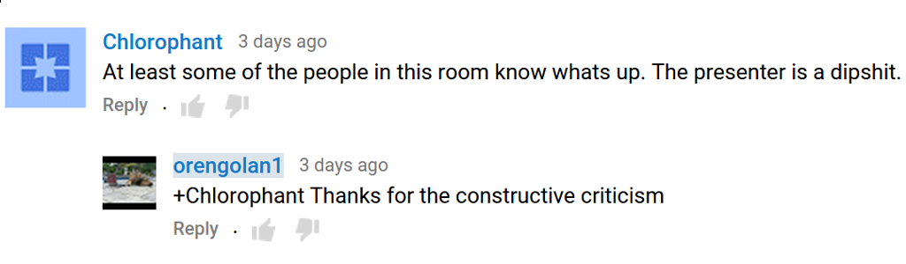
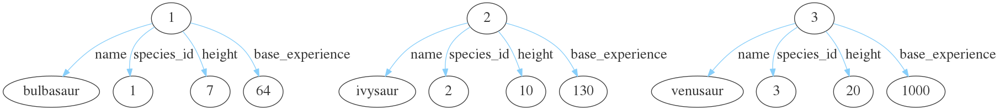
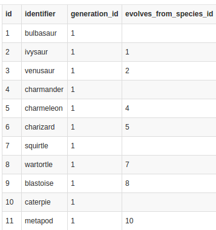
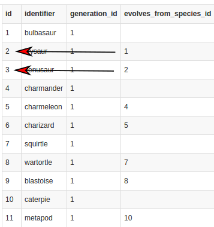
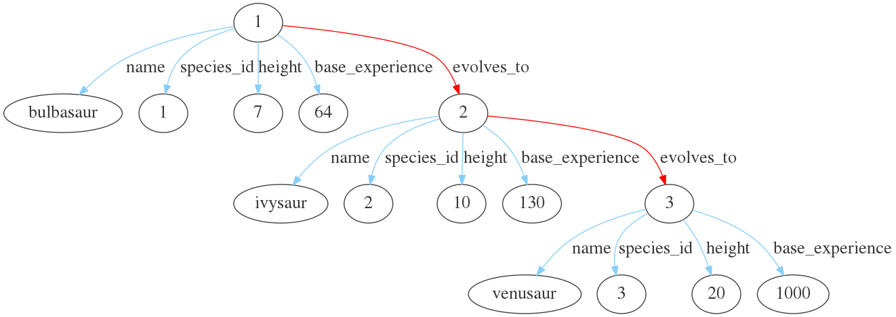

<!-- page_number: true -->

# Evolving Graphs and Pokemon


---

# About us


---

# I love feedback!

---



---

# What is a graph?


A set of vertices and edges (or node and relationships)

---

# What is a graph *database*?

It is a structured way of storing and accessing a graph.

---

# Why graph database?
* Relationship
* Whiteboard friendly
* Performance
* Flexibility

---


---


---


---


---


---


---


---

# What is an *RDF* graph database?
RDF is just how the data is stored.  It is a **"Resource Description Framework"**.


---

You can consider Cayley as being made up of two parts.  **Quads** (RDF Quads) representing the data, and **Queries** representing how to get data back from those quads. 

---


---

# Example


3 quads:

    Bob     "Listens To"   "Rock Music"   . 
    Bob      Drives         BMW           . 
    Julie   "Listens To"   "Rock Music"   . 
    
Quad format:

    Subject  Predicate      Object

---

# Gotcha 1: Directionality

```Bob -> Listens To -> Rock Music```

but... 

Rock Music never Listens To Bob ... because Rock Music is a bad friend. 

---

# Gotcha 2: Duplicate quads

Duplicate quads make no sense, as they are already completely stored.  You can either ignore them or error on them depending on data expectations.


---

# Queries

A query is how we get data back from the database, Cayley support multiple query systems. The most common one is Gizmo which is a full JavaScript implementation.

 

```g.V("Bob").Out("Listens To").All();```
would return **Rock Music**.

---

# Breathe

You are doing great! 
At this point, we know enough to be dangerous.

---

# Back to Pokemon

---
## Our plan

1. Import Pokemon from CSV into Cayley
2. Query and display all Pokemon
3. Add uniqueness
4. Update a quad
5. Show evolution of Pokemon
6. Make our graph an RDF

---

Step 1. Import Pokemon from CSV into Cayley

https://github.com/PokeAPI/pokeapi/tree/master/data/v2/csv


---

Step 1. Import Pokemon from CSV into Cayley

https://github.com/PokeAPI/pokeapi/tree/master/data/v2/csv




---

Step 5. Show evolution of Pokemon

https://github.com/PokeAPI/pokeapi/blob/master/data/v2/csv/pokemon_species.csv

---



---



---


---



---

---

6. Make our graph an RDF

---

## Let's try the following:

1. Replace the Storage Engine (from BoltDB to PostgreSQL)
2. Use Cayley's Web console
3. Use Cayley's HTTP API
4. Use Cayley's Repl

---

1. Replace the Storage Engine(from BoltDB to PostgreSQL)

```
  cayley dump --db=bolt --dbpath=data/pokemon.boltdb   # dump the database into a quad file
  cayley init --config=cayley.cfg                      # assumes the database exist but no table
  cayley load --config=cayley.cfg --quads=dbdump.nq    # load a quad file and using a configuration file
```

---

2. Web console

```
cayley http --config=cayley.cfg
````
http://localhost:64210

---

Find what pichu evolves into after 2 phases of evolution

```
g.V("pichu").In("<schema:name>").Out("<rdf:evolves_to>").Out("<rdf:evolves_to>").Out("<schema:name>").All()
  
{
  "result": [
  {
    "id": "raichu"
  }
  ]
}
```

---
 
Find all pokemons that are the result of 2 phases of evolution

```
g.V().In("<schema:name>").Out("<rdf:evolves_to>").Out("<rdf:evolves_to>").Out("<schema:name>").All()

```

---


---

Find all the evolutions of eevee

```
g.V("eevee").In("<schema:name>").Out("<rdf:evolves_to>").Out("<schema:name>").All()
  
{
 "result": [
  {
   "id": "leafeon"
  },
  {
   "id": "sylveon"
  },
  {
   "id": "vaporeon"
  },
  {
   "id": "flareon"
  },
 ... more results ...
 ]
}
```

---

3. HTTP API

Find all the evolutions of eevee

```
curl http://localhost:64210/api/v1/query/gremlin -d 'g.V("eevee").In("<schema:name>").Out("<rdf:evolves_to>").Out("<schema:name>").All()'
```

---

4. Repl

```
cayley repl --config=cayley.cfg
```

---

# Additional Reading

- Cayley Repository -  https://github.com/cayleygraph/cayley
- Cayley Forum - https://cayley.io
- Chat - #cayley on Freenode

---

# Thank you!
