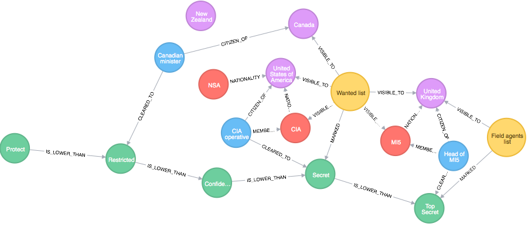
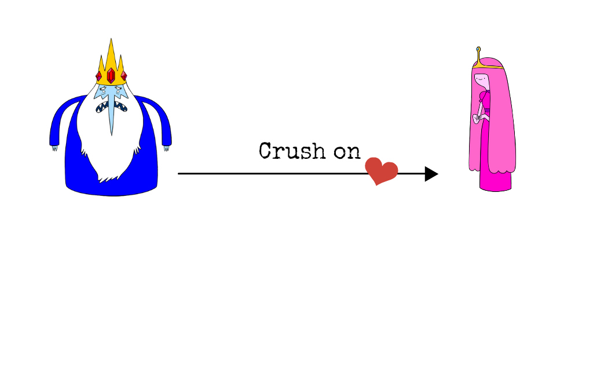
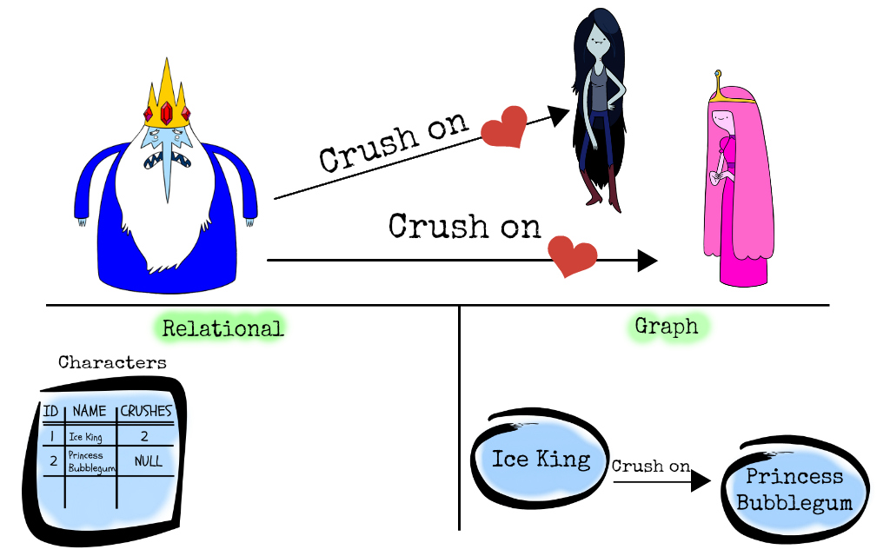
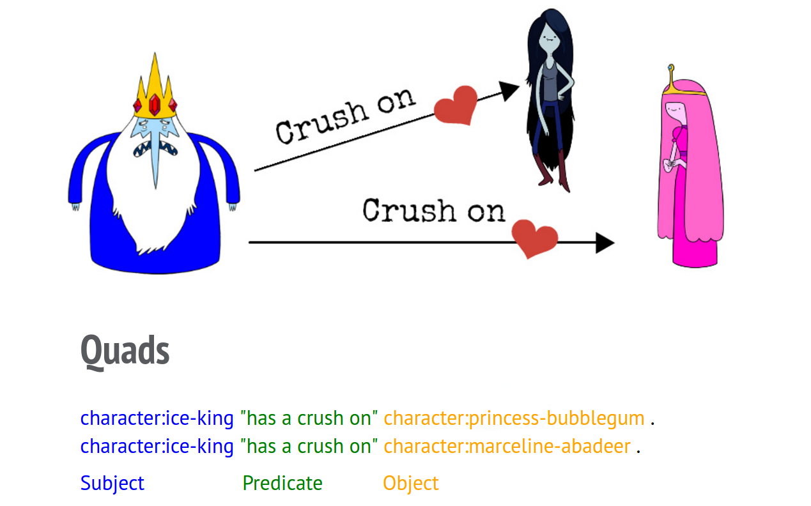
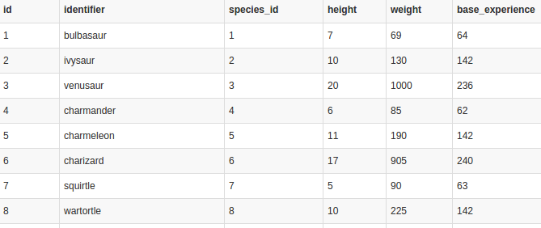

<!-- page_number: true -->

# Evolving Graphs and Pokemon


---

# About us


---

# What is a graph?


A set of vertices and edges (or node and relationships)

---

# What is a graph *database*?

It is a structured way of storing and accessing a graph.

---

# Why graph database?
* Relationship
* Whiteboard friendly
* Performance
* Flexibility
---



---


---


---



---


---


---


---

# What is an *RDF* graph database?
RDF is just how the data is stored.  It is a **"Resource Description Framework"**.


---

You can consider Cayley as being made up of two parts.  **Quads** (RDF Quads) representing the data, and **Queries** representing how to get data back from those quads. 

---



---

# Example


3 quads:

    Bob     "Listens To"   "Rock Music"   . 
    Bob      Drives         BMW           . 
    Julie   "Listens To"   "Rock Music"   . 
    
Quad format:

    Subject  Predicate      Object

---

# Gotcha 1: Directionality

```Bob -> Listens To -> Rock Music```

but... 

Rock Music never Listens To Bob ... because Rock Music is a bad friend. 

---

# Gotcha 2: Duplicate quads

Duplicate quads make no sense, as they are already completely stored.  You can either ignore them or error on them depending on data expectations.


---

# Queries

A query is how we get data back from the database, Cayley support multiple query systems. The most common one is Gizmo which is a full JavaScript implementation.

 

```g.V("Bob").Out("Listens To").All();```
would return **Rock Music**.

---

# Breathe

You are doing great! 
At this point, we know enough to be dangerous.

---

# Back to Pokemon

---
## What are we going to do?

1. Import Pokemon from CSV into Cayley
2. Query and display all Pokemon
3. Add uniqueness
4. Update a quad
5. Show evolution of Pokemon
6. Make our graph an RDF

---

1. Import Pokemon from CSV into Cayley



https://github.com/PokeAPI/pokeapi/tree/master/data/v2/csv

---

## Let's try the following:

1. Replace the Storage Engine
2. Run Cayley as an application
3. Use Cayley's Web interface, Repl, and HTTP API

---

# Additional Reading

- cayley.io

---

# Thank you!
